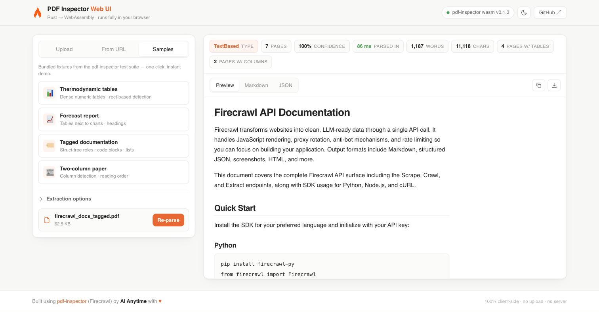

# PDF Inspector UI

A zero-dependency client-side web application designed for the [pdf-inspector](https://github.com/firecrawl/pdf-inspector) Rust library by [Firecrawl](https://firecrawl.dev). This tool enables users to convert PDF documents into structured Markdown directly within the web browser. Because the underlying Rust parser is compiled to WebAssembly (WASM), processing is executed entirely client-side—requiring no backend infrastructure, server uploads, or API credentials.

Built by **Phani Siginamsetty** using the WebAssembly compilation of Firecrawl's pdf-inspector [1].

**[▶ Access the Live Demo](https://phanikumar96.github.io/pdf-inspector-ui/)**



---

## Technical Overview

- **Input Support:** Accepts local file uploads (drag-and-drop or file picker), remote PDF URLs, or any of the four bundled sample files for testing.
- **Real-Time Telemetry:** Displays critical metadata and parsing performance, including PDF layout type, page count, classifier confidence score, processing time, character/word counts, page numbers containing tables or columns, identification of pages requiring OCR, and encoding flags.
- **Multi-Tab Output Viewer:** 
  - **Rendered HTML:** Previews the formatted Markdown layout.
  - **Raw Markdown:** Displays the plain-text Markdown payload.
  - **JSON Representation:** Provides the full parser payload.
- **Export Controls:** Features quick-copy buttons to duplicate output directly to the system clipboard, alongside file download options for both `<filename>.md` and `<filename>.json`.
- **Parsing Parameters:** Allows customization of extraction profiles (e.g., `fidelity` vs. `compact`), targeted page range filtering (e.g., `1,3,5-10`), customized page division markers, image placeholder behavior, and password input fields for encrypted PDFs.
- **Performance Optimizations:** Leverages a multi-threaded design by offloading parsing operations to a Web Worker thread, keeping the main UI thread responsive during heavy parsing loads. Features an native-looking responsive layout with adaptive light and dark theme styling.

### Performance Indicators
Under typical conditions, a 15-page (2.1 MB) document parses in approximately 190 ms, while a 3-page, table-dense datasheet executes in approximately 55 ms.

---

## Local Execution

To run the application locally, use any static file web server. Note that launching `index.html` via the `file://` protocol will fail due to browser security restrictions surrounding WebAssembly compilation and ES Modules.

Using Python's standard library:
```bash
python3 serve.py          # Starts on http://127.0.0.1:8000
python3 serve.py 8777     # Pick a custom port
```

Alternatively, you can utilize Node or other command-line utilities:
```bash
npx serve .
caddy file-server
```

---

## Directory Structure

This project contains zero external JavaScript dependencies or build tools.

```
├── index.html      # UI Structure
├── styles.css      # Theme configuration & responsive styling
├── app.js          # Controller: Input handling, telemetry updates, UI state
├── md.js           # ~150-line custom markdown-to-HTML sanitizer and renderer
├── worker.js       # Background thread manager for WASM parsing
├── serve.py        # Static file web server (Python standard library only)
├── vendor/         # WebAssembly binaries (pdf_inspector_wasm.js & .wasm)
└── samples/        # Testing fixtures from the pdf-inspector repository
```

---

## Deployment

The application is composed of static files. Since single-threaded WASM execution does not require cross-origin isolation headers (`COOP`/`COEP`), it is compatible with all major static web hosts. To host your own, point GitHub Pages, Cloudflare Pages, Netlify, or Vercel at the repository root folder without specifying a build command or output directory.

---

## Updating the Parser Engine

The `vendor/` directory contains WebAssembly bindings generated from the [pdf-inspector](https://github.com/firecrawl/pdf-inspector) Rust crate [1]. To update this output with a new engine revision:

1. Install `wasm-pack`:
   ```bash
   cargo install wasm-pack --version 0.15.0 --locked
   ```
2. Build the target WASM files:
   ```bash
   wasm-pack build wasm --target web --release --out-dir /tmp/wasm-out
   ```
3. Copy the compiled outputs to the UI directory:
   ```bash
   cp /tmp/wasm-out/pdf_inspector_wasm.js \
      /tmp/wasm-out/pdf_inspector_wasm_bg.wasm \
      /tmp/wasm-out/pdf_inspector_wasm.d.ts \
      path/to/pdf-inspector-web-ui/vendor/
   ```

---

## Operational Notes

- **Remote URL Input & CORS:** Fetching remote URLs is restricted by the destination host's Cross-Origin Resource Sharing (CORS) policies. To handle this, remote URL requests are piped through public proxies (`corsproxy.io` or `allorigins.win`). For sensitive, proprietary, or private documents, always utilize the file uploader, ensuring data remains entirely inside your browser sandbox.
- **Scanned Document Handling:** `pdf-inspector` is structured as a structural and semantic layout analyzer; it does not perform optical character recognition (OCR) [1]. Image-based files are identified as `Scanned` or `ImageBased`, indicating which pages require an external OCR step.
- **On-Screen JSON View Optimization:** To keep the JSON browser tab clean and responsive, the `markdown` property text is omitted from the on-screen display. The full payload is preserved intact when downloading or copying from the JSON viewer.

---

## License

This project is licensed under the MIT License - see the [LICENSE](LICENSE) file for details. The pre-compiled WASM binary in the `vendor/` directory is compiled from the MIT-licensed code at [firecrawl/pdf-inspector](https://github.com/firecrawl/pdf-inspector) [1]. Sample testing documents are provided from the original upstream repository.
